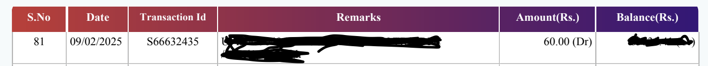

# Finance Statement Analyzer

A Python tool for extracting, cleaning, and analyzing bank statement data from PDF files for income tax calculations and financial reporting.

## Overview

This project automates the process of:
1. **Extracting** transaction data from PDF bank statements
2. **Cleaning** and structuring the data 
3. **Categorizing** transactions (salary, dividends, other credits)
4. **Generating** financial reports for tax purposes

## Features

- 📄 **PDF Extraction**: Extract transaction data from PDF bank statements using regex
- 🧹 **Data Cleaning**: Parse and structure raw transaction text into organized data
- 💰 **Income Categorization**: Automatically categorize transactions into:
  - Salary payments (Use your company name)
  - Dividends and interest (NACH, INT.PD)
  - Other significant credits (>₹5000)
- 📊 **Financial Analysis**: Calculate totals and generate monthly summaries
- 📋 **Report Generation**: Create detailed markdown reports for tax calculations
- 💸 **Expense Tracking**: Identify largest expenditures

## Project Structure

```
finance/
├── clean_statement.py      # Main script for PDF extraction and data cleaning
├── final.py               # Analysis and report generation script
├── requirements.in        # Core dependencies
├── requirements.txt       # Pinned dependencies (auto-generated)
├── statements/           # Directory for PDF bank statements
│   ├── FY-2024-2025.pdf
│   └── statement_unlocked.pdf
├── reports/              # Generated analysis outputs
│   ├── clean_transactions.csv
│   └── bank_report.md
```

## Installation

1. **Clone or download** this repository
2. **Install dependencies** using pip:

```bash
# Install from requirements.txt (recommended)
pip install -r requirements.txt

# Or install from requirements.in
pip install -r requirements.in
```

### Dependencies
- **Python 3.12+**
- **pandas**: Data manipulation and analysis
- **pdfplumber**: PDF text extraction and parsing

## Usage

### Step 1: Extract and Clean Data

Place your PDF bank statement in the `statements/` directory and run:

```bash
python clean_statement.py
```

This script will:
- Extract text from `statements/statement_unlocked.pdf`
- Parse transactions using regex patterns
- Clean and structure the data
- Save results to `reports/clean_transactions.csv`
- Display summary statistics

### Step 2: Generate Financial Report

Run the analysis script:

```bash
python final.py
```

This will:
- Load the cleaned transaction data
- Categorize transactions by type
- Calculate totals for tax purposes
- Generate a detailed markdown report (`bank_report.md`)

## Output

The analysis generates a comprehensive report including:

(Adjust the regex values based on your statemtent, these are the ones that fit mine)

### 💼 Salary Transactions
- All salary payments (just include your company name in the regex)
- Total salary credited

### 💰 Dividend Transactions  
- Stock dividends (NACH transactions)
- Bank interest payments (INT.PD)
- Total dividend income

### 📥 Other Credits (>₹5000)
- Significant credit transactions excluding salary/dividends
- Total other income

### 📊 Summary
- **Total income for tax calculations**
- **Largest single expenditure**
- Monthly transaction summaries

## Sample Output

```
Total Salary Credited: ₹xxx,xxx.00
Total Dividends Credited: ₹xxx,xxx.00
Total Other Credits (>5000): ₹xxx,xxx.00
TOTAL CREDITED FOR INCOME TAX CALC: ₹xxx,xxx.00
```

## Transaction Pattern

The script recognizes transaction patterns in this format (Make sure the pdf is text based): 


```
S.No Date TransactionID Remarks Amount (Dr/Cr) Balance (Cr)
```

Example output:
```
123 25/12/2024 TXN12345 SALARY PAYMENT 50,000.00 (Cr) 1,25,000.00 (Cr)
```

## Customization

### Modify Transaction Categories

Edit the regex patterns in `final.py` to customize transaction categorization:

```python
# Salary pattern
salary_df = df[df["Remarks"].str.upper().str.contains("YOUR_EMPLOYER", na=False)]

# Dividend pattern  
dividend_df = df[df["Remarks"].str.upper().str.contains("YOUR_PATTERN", na=False)]
```

### Adjust Credit Threshold

Change the minimum amount for "other credits":

```python
other_df = df[(df["Credit"] > YOUR_AMOUNT)]  # Default: 5000
```

## Notes

- Ensure PDF statements are **unlocked** before processing
- The regex pattern may need adjustment for different bank statement formats
- All amounts are processed in the original currency (₹ for Indian Rupees)
- Date format expected: DD/MM/YYYY


